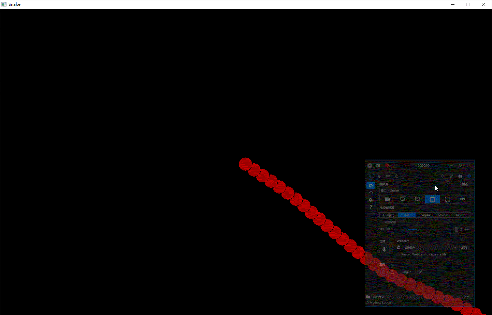

# 贪吃蛇 (Snake)-Alpha 开发文档

## 运行环境及主要实现功能概述

- 运行平台: Winodws
- 主要功能: 可视化操作界面，贪吃蛇逻辑及多人联机功能

## 第三方库

- EasyX 渲染
- WinSock2 服务器-客户端的请求交换
- irrKlang 游戏音频播放

## 概念定义	<font color=green>**完成**</font>

- 极坐标系0°位置为x轴正方向，向逆时针方向递增，范围：0°~359°
- 平面直角坐标系坐标原点为窗口左上角顶点，$x$、$y$ 轴正方向分别为右方和下方
- 平面直角坐标系单位长度为1像素 (pixel)

## 数学推导	<font color=green>**完成**</font>

- 定义向量数据类型
- 通过两点坐标计算两点连线与 $x$ 轴夹角	<font color=yellow>angleToXAxis( )</font>
- 已知两横平竖直的矩形（边与 $x$ 轴或 $y$ 轴平行），求两矩形是否碰撞（AABB碰撞）	<font color=yellow>isContact( )</font>
- 已知两圆形，求两圆形是否有公共点（是否碰撞）	<font color=yellow>isContact( )</font>

## 计划实现的功能

### 实现按钮(BUTTON类)、输入框(ENTRY_BOX类)等控件的定义	<font color=green>**完成**</font>

- 按钮的文本显示、按下反馈等功能
- 输入框的提示文本、焦点显示、输入检测等

### 实现基本图形渲染

- 文字及几何图形渲染	<font color=green>**完成**</font>
- 渲染控件	<font color=green>**完成**</font>
- 贴图实现	<font color=green>**完成**</font>
- 利用变量控制画面缩放	<font color=green>**完成**</font>
- 界面美化	

### 实现玩家基本逻辑

- 玩家$(PLAYER)$、地图$(MAP)$等基本类	<font color=green>**完成**</font>
- 键盘及鼠标输入控制玩家	<font color=green>**完成**</font>
- 玩家地图中正常移动	<font color=green>**完成**</font>
- 玩家地图中吃掉食物	<font color=green>**完成**</font>
- 玩家碰到自己的死亡逻辑	<font color=green>**完成**</font>
- 玩家碰到地图边缘的死亡逻辑
- 玩家碰到其他玩家的死亡逻辑
- 玩家加速等附加功能	<font color=green>**完成**</font>
- 在玩家头顶显示玩家姓名

### 服务器-客户端请求处理

### 实现排行榜、聊天区等辅助功能

- 实时更新排行
- 显示前十玩家姓名与玩家自身排名
- 加入背景音乐与音效

### 优化

- 网络通信
- 游戏画面
- 渲染速度
- 音效播放机制

### <font color=red>**(挑战)**</font> 加入机器人玩家

- 主动得分
- 避障基本逻辑
- 击杀玩家

## 函数接口

### 功能模块

| **源文件**    |    **自定义依赖项**    | **功能** |
|:------:       |:-----:                 |:---:|
|Input.h        |*none*                  |全局输入处理|
|shape.h        |*none*                  |几何形状定义|
|myMath.h       |*none*                  |数学类及函数定义|
|AABB.h         |shape.h                 |图形碰撞检测|
|snake.h        |myMath.h, Input.h       |全局变量及类定义|
|myImages.h     |snake.h                 |贴图管理及渲染函数定义|
|clientSocket.h |snake.h                 |定义客户端通信方法|
|serverSocket.h |snake.h                 |定义服务端通信方法|
|button.h       |AABB.h,Input.h,shape.h  |定义按钮控件类|
|entryBox.h     |button.h                |定义输入框控件类|
|main.cpp       |*all*                   |主函数及主要功能|

### Input.h - 输入信息监测与处理

- _checkKeyButton(char) 无返回值，内部调用，更新指定按键状态
- _checkInput() 无返回值，全局调用，更新键盘状态记录

### shape.h - 几何形状定义

- myRECTANGLE 矩形
- myCIRCLE 圆形

### myMath.h - 数学类及函数定义

- _degToRad(float) 返回float值，角度值转弧度制
- _radToDeg(float) 返回float值，弧度制转角度值
- angleToXAxis(int,int,int,int) 返回 $float$ 值，求两点连线与 $x$ 轴正半轴夹角
- __distance(POINT, POINT) 计算两点距离

### AABB.h - 图形碰撞检测

- isContact(myRECTANGLE,myRECTANGLE) 判断两矩形是否接触，返回 $bool$ 值
- isContact(myRECTANGLE,POINT) 判断点是否在矩形内，返回 $bool$ 值
- isContact(myCIRCLE,myCIRCLE) 判断两圆形是否接触，返回 $bool$ 值
- isContact(myCIRCLE,POINT) 判断点是否在圆形内，返回 $bool$ 值

### snake.h - 主要功能定义

- 蛇节定义
```C++
struct BODY
{
    int x,y,size;	// 坐标  半径
	myCIRCLE aabb;	// 用于击杀判定

	BODY(int x,int y, int size);
	void update();	// 更新碰撞箱
};
```

- 玩家（蛇）定义
```C++
struct PLAYER
{
private:
	float dir,speed;	// 蛇头朝向 移动速度
	int len,paintDis;	// 蛇长度 绘制间隔
	vector<BODY> snake;	// 蛇节存储
public:
	void init(float x, float y, int _len);	// 初始化蛇
	void move();	// 移动蛇
	void update(int ox,int oy);	// 更新玩家操作
	void draw();	// 渲染蛇
	void checkDie();	// 检查死亡状态
	pair<float,float> getHeadPos();	// 获取蛇头坐标
};
```

- 变量及数组定义
```C++
#define MAX_CLIENT 100	// 最大客户端数
#define MAX_BUF_SIZE 1024	// 最大缓冲区大小
#define MAX_TEXTURES 100	// 最大贴图数量

int windowW,windowH;	//窗口宽高
WSADATA wsd;	// SOCKET 通信
float FPS = 60.0f;	// 目标FPS
int64_t frameDelayNs = static_cast<int64_t>(1000.0f / FPS * 1e6);	//每帧等待时间(ns)
const int PORT = 8000;	// SOCKET 通信端口
long long unsigned int NOW_TIME;	// 当前时间

float cameraX,cameraY,zoomFactor = 2.0f;	// 相机坐标 相机画面缩放倍率

char recvBuf[MAX_BUF_SIZE];	// SOCKET通信 接收缓冲区
char sendBuf[MAX_BUF_SIZE];	// SOCKET通信 发送缓冲区
map<SOCKET, PLAYER> players;
```

- initFood(int) 生成 $int$ 个食物
- getTime() 获取 时间/ms, 存储至NOW_TIME
- PLAYER::init(float,float,int) 初始化，两个 $float$ 为出生点坐标，$int$ 为长度
- PLAYER::update(int,int) 传入虚拟摇杆坐标原点，根据鼠标坐标更新朝向
- PLAYER::move() 移动蛇
- PLAYER::draw() 渲染蛇
- PLAYER::checkDie() 检查是否死亡，返回 $bool$ 值，$true$ 为死亡
- PLAYER::checkEat() 吃食物
- PLAYER::getHeadPos() 获取蛇头坐标，返回 $pair<float, float>$


### myImages.h - 贴图管理

- loadTexture(string _path) 传入贴图名称，从*assets/picture/_path* 加载
- paintTexture(int,int,string) 传入贴图坐标及素材名称，在指定位置贴图，失败返回-1

### clientSocket.h - 客户端网络通信

- connectServer(string) 传入服务器IP，连接至服务器，成功返回0
- contact() 与服务器通信一次

### serverSocket.h - 服务器网络通信

- ServerThread(LPVOID) 客户端通信线程，外部不访问
- runGameServer() 运行服务器，处理客户端连接请求

### button.h - 按钮控件

- 属性
```C++
bool focus;	// 是否为焦点
bool center;	// 文字是否居中
string text;	// 提示文字
COLORREF textColor;	// 文字颜色
COLORREF focusColor;	// 按钮为焦点时颜色
myRECTANGLE rect;	// 按钮形状及位置
```
- 使用RUTTON创建
- check() 检测是否按下
- draw() 渲染按钮

### entryBox.h - 输入框控件

- 属性
```C++
bool focus;	// 是否为焦点
bool center;	// 文字是否居中
string text,tip;	// 输入的文字  提示文字（text为空时显示）
COLORREF textColor,tipColor;	// 文字颜色 提示颜色
BUTTON _button;	// 用来处理输入、渲染
```
- 使用ENTRY_BOX创建
- checkInput() 检查输入，更新输入内容
- draw() 绘制输入框

## 实现细节

### 蛇移动逻辑

定义多个蛇节，添加头部的新节点，删除尾部的旧节点
以paintDis为间隔绘制蛇身。节点数量越多，移动越平滑。

```C++
void move()
{
	if(snake.size() < 2) return;
	snake.insert(snake.begin(),
		BODY(
			static_cast<float>(snake.front().x + cos(dir) * speed),
			static_cast<float>(snake.front().y - sin(dir) * speed), snake.front().size) );
	
	while(snake.size() > len * paintDis)
	{
		snake.erase(snake.end());
	}
	while(snake.size() < len * paintDis)
	{
		snake.push_back(BODY(snake.back().x,snake.back().y,snake.back().size));
	}
	return;
}
```


### 蛇转向逻辑

获取应朝向的弧度，以固定速度转向
```C++
void update(int ox,int oy)
{
	float change = angleToXAxis(ox,oy,mouse.x,mouse.y);
	if(abs(change - dir) <= M_PI)
	{
		dir += clampf(change - dir, _degToRad(speed * 4), _degToRad(-speed * 4));
	}
	else
	{
		if(dir < M_PI) dir -= clampf(dir + M_PI * 2 - change, _degToRad(speed * 4), _degToRad(-speed * 4));
		else dir -= clampf(change - dir, _degToRad(speed * 4), _degToRad(-speed * 4));
	}
	if(dir < 0) dir += M_PI * 2;
	if(dir > M_PI * 2) dir -= M_PI * 2;
	return;
}
	
```

### 蛇死亡判定

- 碰到自身死亡 从头之后的第四个可见蛇节，依次判断是否与头部碰撞，碰撞则返回 $true$
- 碰到他人死亡 判断玩家蛇头与每条蛇可见蛇节是否碰撞，碰撞则返回 $true$
```C++
bool checkDie()
{
	if(invincible)
	{
		getTime();
		if(NOW_TIME - BURN_TIME > 1000) invincible = false;	// 出生无敌时间 
		return false;
	}
	
	snake[paintDis].updateAABB();
	for(register int i = paintDis * 4; i < bodyLen; i += paintDis)
	{
		setcolor(WHITE);
		snake[i].updateAABB();
		circle(snake[i].aabb.pos.x - cameraX + windowW/2, snake[i].aabb.pos.y - cameraY + windowH/2, snake[i].aabb.radians);
		if(isContact(snake[paintDis].aabb, snake[i].aabb))
		{
			return true;
		}
	}
	return false;
}
```

### 多字节变量的调制/解调协议

#### 调制

- 以 $int$ 类型为例
- 假设有 int data;  将其分为四个 $char$ 传输, 分别为 $c1,c2,c3,c4$

  - c1 = data>>24
  - c2 = data<<8>>24
  - c3 = data<<16>>24
  - c4 = data<<24>>24

- 其他类型同理

#### 解调

- 以 $int$ 类型为例
- 假设有四个 $char$ 被接收, 分别为 $c1,c2,c3,c4$
  - int data = 0;
  - data += c1<<24
  - data += c2<<16
  - data += c3<<8
  - data += c4
  - data即为原始数据

- 其他类型同理

## 服务器通信规则

※ 客户端发送请求，所有运算在服务端完成，之后结果返回给客户端

### 数据传输

- 接收 $int:$ 4个 $char$ 依次转换为最高字节至最低字节
- 发送 $int:$ 最高字节至最低字节依次转换为 4个 $char$
- 接收 $bool:$ 如果为$true$, 则$char$赋值为 $0b11111111$ ；如果为$false$, 则$char$赋值为 $0b00000000$
- 发送 $bool:$ 如果$char$赋值为 $0b11111111$, 则为$true$ ；如果$char$赋值为 $0b00000000$, 则为$false$
- 接收 $float:$ 4个 $char$ 依次转换为最高字节至最低字节
- 发送 $float:$ 最高字节至最低字节依次转换为 4个 $char$

### 客户端第一次通信时发送

- 玩家初始化
- (同步状态)

### 客户端请求更新状态时发送

- $bool$ 玩家是否死亡
- $char$ 玩家数(0~255)
- 顺次更新每个玩家的朝向 $floatDir$ $int$ 长度

### 客户端请求同步状态时发送

- $char$ 客户端数量 (0~255)
- 共 $int$ 个玩家信息: $int$长度 $float$朝向 $int$蛇节大小 $floatX$  $floatY$
- $int$ 食物数量
- 共 $int$ 个食物信息: $intX$  $intY$  $intSize$  $COLORREFcolor$

## 客户端通信规则

### 数据传输

- 接收 $int:$ 4个 $char$ 依次转换为最高字节至最低字节
- 发送 $int:$ 最高字节至最低字节依次转换为 4个 $char$
- 接收 $bool:$ 如果为$true$, 则$char$赋值为 $0b11111111$ ；如果为$false$, 则$char$赋值为 $0b00000000$
- 发送 $bool:$ 如果$char$赋值为 $0b11111111$, 则为$true$ ；如果$char$赋值为 $0b00000000$, 则为$false$
- 接收 $float:$ 4个 $char$ 依次转换为最高字节至最低字节
- 发送 $float:$ 最高字节至最低字节依次转换为 4个 $char$

### 请求

- 发送请求类型 $char$ (1:更新状态, 2:请求同步状态, 3:停止传输)

### 更新状态

- 发送 $floatDir$ $bool$是否加速

### 停止传输

- 发送 "CLIENT_EXIT"